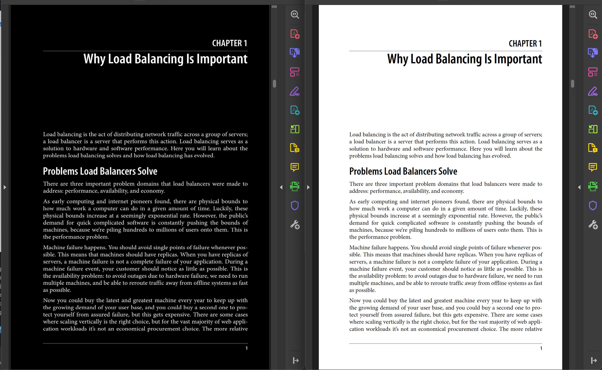

# Dark PDF 

This is an automated tool which converts background of PDF to Dark and automatically releases it. 

CI file runs when something is changed on files which ends with `*.pdf` under [./uploads](./uploads). 

To run the automated tool it is enough to add PDF files to [./uploads](./uploads) then CI file will automatically start. 

## Example 

 
 
 